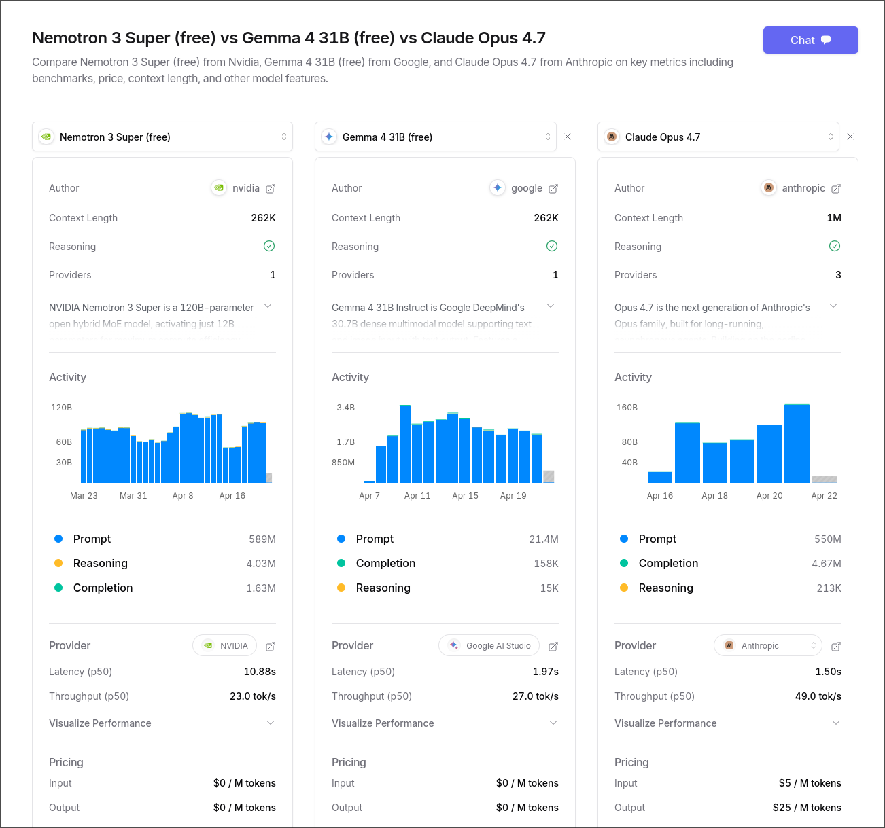

# Hermes connects Nvidia Nemotron Model via OpenRouter for Free

## Background

- Installed Hermes
- Wanted to test a few free models

## Takeaways

- You can set OpenRouter with a primary model and fallback models
- Setup should be almost the same if you use OpenClaw 🦞


## Register OpenRouter

- Create an account and obtain `OPENROUTER_API_KEY`. Run the following command, the key will be saved in `~/.hermes/.env`
- Create an account and get your `OPENROUTER_API_KEY`. Run this command and the key will be saved in `~/.hermes/.env`.

  ```sh
  hermes config set OPENROUTER_API_KEY sk-or-v1-...
  ```

- OpenRouter has a lot of free models your agent can use. Some are not strong enough for production, but they are great for testing your setup. A few free ones are actually pretty capable, like Nvidia Nemotron and Google Gemma.

- You can also pick paid models directly from providers or through OpenRouter.

- Right now, there are no free image/video generation models on OpenRouter. Hopefully that changes later.

- Limitation: free models may hit rate limits and get lower priority during busy times.

A quick comparison chart is attached to show differences between Nvidia Nemotron, Google Gemma, and Claude's current flagship model, Opus 4.7.



There is also a short explanation of reasoning vs completion at the end of this article.

## In Hermes

#### Backup your current config.yaml

```sh
cp ~/.hermes/config.yaml ~/.hermes/config.yaml.backup
```

#### Show current model configuration

```sh
hermes config show
```

You should see any other configured model similar to this
You should see a configured model similar to this:
```
◆ Model
  Model:        {'default': 'elephant-alpha', 'provider': 'openrouter', 'base_url': 'https://openrouter.ai/api/v1', 'api_mode': 'chat_completions'}
  Max turns:    90
```

#### Set the primary model

```sh
hermes config set model.provider openrouter
hermes config set model "nvidia/nemotron-3-super-120b-a12b:free"

✓ Set model = nvidia/nemotron-3-super-120b-a12b:free in /home/jeff/.hermes/config.yaml
```

#### Configure fallback models

```sh
hermes config edit
```

Then edit it manually:
```yaml
model:
  default: nvidia/nemotron-3-super-120b-a12b:free
  provider: openrouter
  base_url: https://openrouter.ai/api/v1
  api_mode: chat_completions
providers: {}
fallback_providers:
- provider: openrouter
  model: openrouter/free
- provider: openrouter
  model: openrouter/elephant-alpha
```


> Note: `openrouter/free` provides best available free models from OpenRouter

Restart gateway
```sh
hermes gateway restart
```

#### Other free available models

You can also browse free and paid models from OpenRouter and NousResearch here:

https://openrouter.ai/models?q=free
https://portal.nousresearch.com/models

#### Free usage limit

When using free model via OpenRouter, you may receive a warning:

```txt
API call failed after 3 retries: HTTP 429: Rate limit exceeded: free-models-per-day. Add 10 credits to unlock 1000 free model requests per day
```

This message comes from OpenRouter.ai. You can add 10 credits to avoid this message without being charged.


## Difference between Reasoning and Completion

The main difference is how the model gets to the answer. A **completion** model predicts the most likely next word from learned patterns, while a **reasoning** model works through steps before giving the final response.

Core Definitions
- **Completion** (Pattern Matching): The model predicts the next most likely word (token) from patterns in training data. It usually responds in a single pass, so it is often faster and more fluent, but less deep.
- **Reasoning** (Logical Deliberation): The model goes through an internal thinking phase, breaks a problem into steps, explores options, and checks itself before replying.