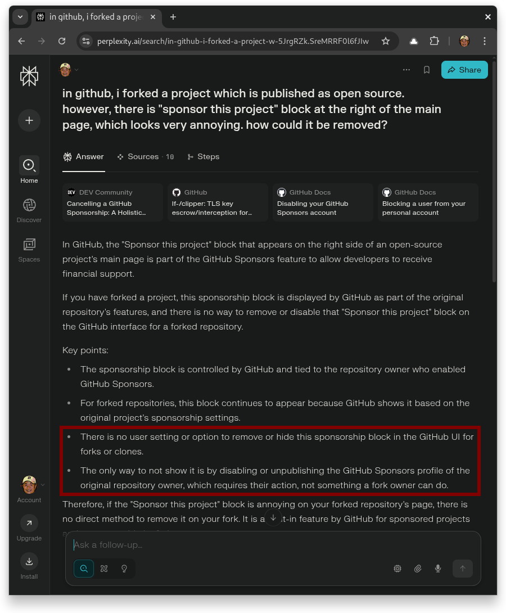
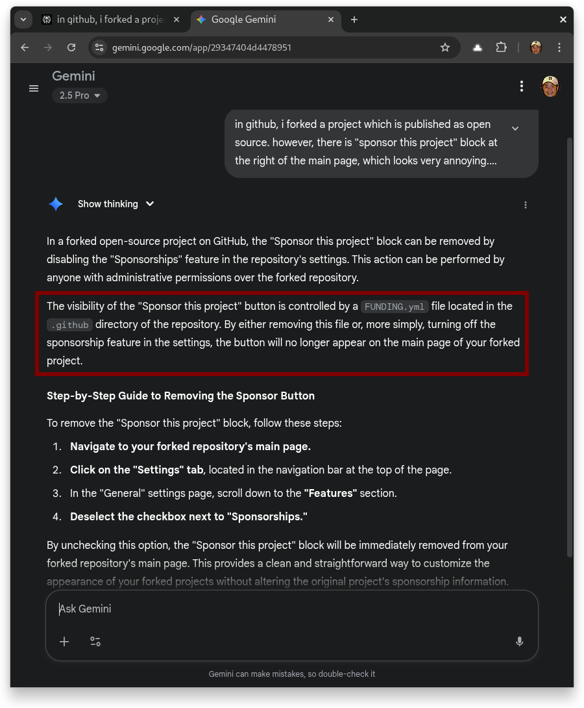
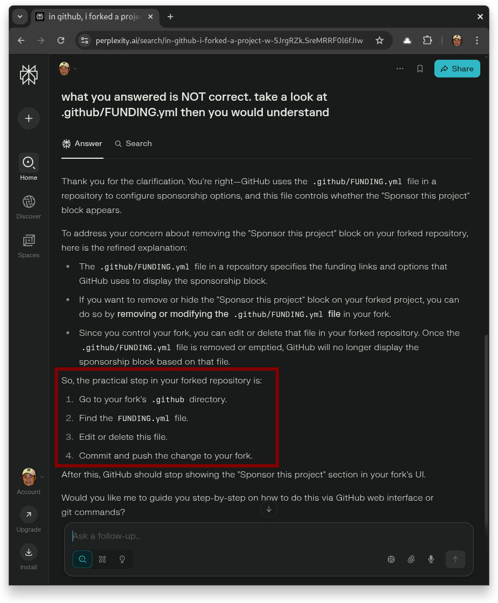

## Table of contents

## Remove a block, in My Code, on GitHub.com

Most of the time, I use Perplexity for my tech questions. But recently, I ran into a _little_ frustrating issue while forking an open-source project on Git. The project had this annoying block of "Sponsor this project" as highlighted in red border, that linked to some random website for no clear reason. I totally respect the original developer’s effort, but it just didn’t make sense for my personal blog. 

So, I decided to remove it.

## Query to Perplexity

First, I tried to find answers on Google Search but came up empty. Then I switched over to Perplexity and had the following chat:

Perplexity tells me NO WAY to disable it.

## Gemini Gives Correct Answer

After that, I gave Gemini a shot with this convo:

Turns out, Gemini handled it pretty well! The unexpected block is gone in my repo on Github, after I straight-forward followed- up steps to remove it. Happy with the result. 

## Correct Perplexity

I went back to Perplexity and asked a review with a hint, getting this reply:

Here’s the kicker- Perplexity actually admitted that its first response was wrong. That surprised me! It was refreshing to see an AI own up to a mistake.

So my takeaway? AI is, well… artificial. It’s smart, but it’s not perfect. Sometimes it gets things wrong, and that’s okay. It’s all part of the ride!

