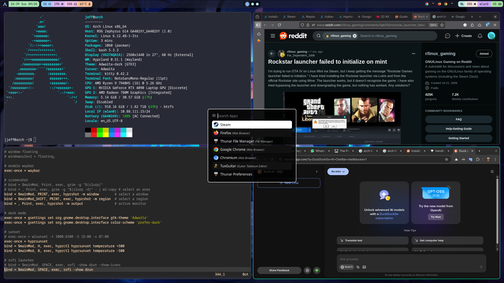
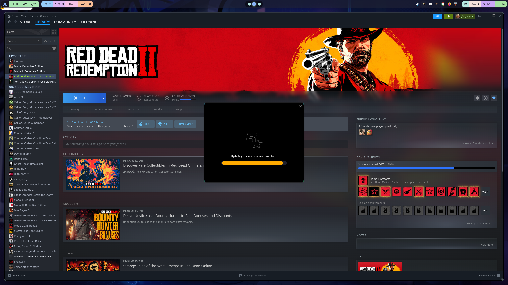
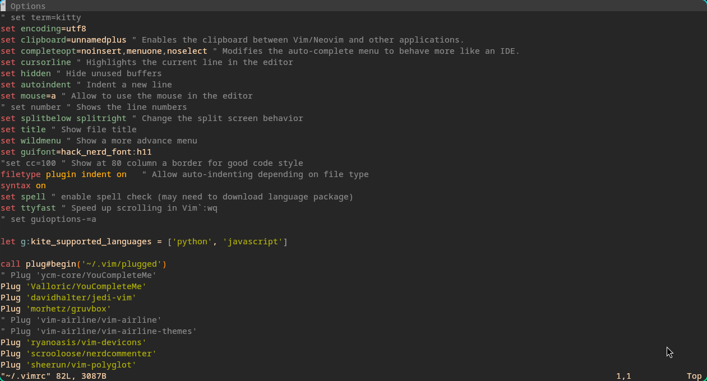

---
author: Jeff Yang
pubDatetime: 2025-09-28T20:58:52.737Z
modDatetime: 2025-09-29T09:25:46.734Z
title: A Journey for ArchLinux+ Hyprland+ Steam on ROG Zephyrus G14 with Nvidia 4090
tags:
  - arch
  - archlinux
  - linux
  - opensource
  - steam
  - windows
  - microsoft
  - philosophy
  - negativespace
  - 留白
description: Using Linux is like embracing the quiet space between things - **simple**, **clean**, **open**, and **honest**. 
featured: true
---

## Philosophy

Using Linux is like embracing the quiet space between things - **simple**, **clean**, **open**, and **honest**. You take only what you need, no extra weight, no noise, just what serves your purpose. It’s pure do-it-yourself, crafting your path bit by bit. Small and lasting, rooted deep in the old ways of Unix, steady and enduring while the world rushes by chasing change. This calm stillness, this “**negative space** (**留白**),” holds its shape through decades-unmoved by the chaos, the noise, the flood of new fads. In that emptiness, the true essence stays.

> [Wikipedia](https://en.wikipedia.org/wiki/Negative_space): In art and design, negative space or negative volume is the empty space around and between the subject(s) of an image.[2][3] In graphic design this is known as white space. Negative space may be most evident when the space around a subject, not the subject itself, forms an interesting or artistically relevant shape, and such space occasionally is used to artistic effect as the "real" subject of an image. 

## ArchLinux


#### My Arch Linux Journey (a love-hate story)

I've been using **Arch Linux** (and sometimes **Manjaro**) as my main workstation for years. I even installed and configured Arch on MacBook Pro hardware, just for the challenge. I’ve been a **Linux user for over 20 years**, and I still love its open-source spirit. Over time, I’ve played around with **Fedora**, **Ubuntu**, **Debian**, and more. My default editor? Always **`vim`** — no contest.


Recently, I decided to **install Arch Linux again** on my **ROG Zephyrus G14** with an **NVIDIA 4090**.
The goal was simple: **ditch Windows completely** and make Arch my one and only workstation.

I’ll be honest — it wasn’t all smooth sailing. I spent years on **Manjaro** because it just made life easier, especially when it came to **NVIDIA setup**. But after a while, I missed the pure Arch experience — the control, the learning — so I came back. Let’s just say, switching back was the only way I could *eat and sleep well* again.


Still, the **installation process** was rough. I probably spent **four hours** getting the base system up and running, and I made plenty of mistakes along the way:

* Messed up the **`EFI` flag** on the EFI partition using `fdisk`.
* Mounted partitions incorrectly before running `arch-chroot`.
* Manually created `/boot/efi`, which completely broke the **GRUB bootloader** - it showed up *empty*.

If you’re going through this too, **the Arch Wiki is your best friend**:

> [Arch Wiki – GRUB](https://wiki.archlinux.org/title/GRUB)


## My Hardware and How It Looks with Arch Installed




<!--
```sh
                  -`                     jeff@arch
                 .o+`                    ---------
                `ooo/                    OS: Arch Linux x86_64
               `+oooo:                   Host: ROG Zephyrus G14 GA402XY_GA402XY (1.0)
              `+oooooo:                  Kernel: Linux 6.16.10-arch1-1
              -+oooooo+:                 Uptime: 3 hours, 12 mins
            `/:-:++oooo+:                Packages: 840 (pacman)
           `/++++/+++++++:               Shell: bash 5.3.3
          `/++++++++++++++:              Display (VG27AQA1A): 2560x1440 in 27", 60 Hz [External]
         `/+++ooooooooooooo/`            WM: Hyprland 0.51.1 (Wayland)
        ./ooosssso++osssssso+`           Theme: adw-gtk3-dark [GTK2/3/4]
       .oossssso-````/ossssss+`          Icons: Adwaita [GTK2/3/4]
      -osssssso.      :ssssssso.         Font: Adwaita Sans (11pt) [GTK2/3/4]
     :osssssss/        osssso+++.        Cursor: default (24px)
    /ossssssss/        +ssssooo/-        Terminal: kitty 0.43.1
  `/ossssso+/:-        -:/+osssso+-      Terminal Font: NotoSansMono-Regular (11pt)
 `+sso+:-`                 `.-/+oso:     CPU: AMD Ryzen 9 7940HS (16) @ 5.26 GHz
`++:.                           `-/+/    GPU 1: NVIDIA GeForce RTX 4090 Laptop GPU [Discrete]
.`                                 `/    GPU 2: AMD Radeon 780M Graphics [Integrated]
                                         Memory: 9.99 GiB / 30.57 GiB (33%)
                                         Swap: Disabled
                                         Disk (/): 795.77 GiB / 1.82 TiB (43%) - btrfs
                                         Local IP (wlan0): 10.88.111.15/24
                                         Battery (GA40249): 100% [AC Connected]
                                         Locale: en_US.UTF-8
```
-->

It has both an AMD Radeon integrated graphics card and a dedicated Nvidia RTX 4090. After this extensive installation, we can see only 840 packages installed.


## Arch Installation

Following the installation guide closely, I think there might be a few hiccups along the way. But honestly, I feel confident that any problems that come up can be sorted out without too much trouble.


> Reference: [Arch Linux Installation Guide](https://wiki.archlinux.org/title/Installation_guide)

#### Partition
So, I went with just two partitions: one is a 2GB EFI boot partition (a lot of guides saying 1GB EFI boot partition is enough. Trust me you need 2GB as latest Kernel and firmware are usually as big as 300MB+. Plus fallback image, 300MB+, the remaining space is less then 300MB, which is insufficient for new kernel), and the rest of the space is for the root (`/`). I’m thinking about enabling **LUKS encryption** on the root partition later on. Just a heads-up though, turning on encryption will make the boot time a bit slower.

#### File System Type
For the root partition, I chose **Btrfs**. It’s a modern file system that supports features like snapshots and compression, which can be really handy.

#### Kernel
I’m using the **DKMS kernel** instead of the LTS kernel because DKMS works better with Nvidia drivers. DKMS basically lets kernel modules (like Nvidia drivers) automatically rebuild when the kernel updates, so you get smoother updates.

#### Essential Packages
Besides the basic recommended packages, here’s what I like to install right after mounting the root partition but before running `arch-chroot`, just my personal setup:

```
base-devel git linux-headers iwctl sudo gvim which rsync bash-completion openssh cmake
```

`iwctl` is very important to install if you don't want to have wired connection for network.


## Hyprland

- I couldn’t sleep or stop thinking about it the first time I saw it — it really grabbed my attention.
- What I love most is its all-in-one config file: `~/.config/hypr/hyprland.conf`. Super convenient to tweak everything in one place.

#### Must-Have

Here are the essentials you want to have running with Hyprland:

```
hyprpolkitagent xdg-desktop-portal-hyprland rofi swaync 
```

- **hyprpolkitagent** handles authentication prompts.
- **xdg-desktop-portal-hyprland** integrates desktop features for apps.
- **rofi** is a versatile app launcher.
- **swaync** keeps your wallpaper in sync smoothly.

#### Eco-System

To complement Hyprland, check out these tools:

```
hyprsunset hyprshot hyprpaper
```

- **hyprsunset** helps with automatic night light adjustment.
- **hyprshot** is for easy screen capturing.
- **hyprpaper** manages dynamic wallpapers.

#### Multi-Media

For sound and media control, these are the essentials:

```
wireplumber pipewire-pulse pavucontrol 
```

- **wireplumber** is the PipeWire session manager, coordinating audio and video streams.
- **pipewire-pulse** provides compatibility with applications expecting PulseAudio.
- **pavucontrol** is a user-friendly volume control interface.


## GPU Drivers

This part can get a bit tricky. Here’s what I did on my ROG Zephyrus G14 laptop to get it all working smoothly.

Basically, we want to disable the open-source `nouveau` driver and switch to the official Nvidia proprietary driver for better performance and compatibility.

#### Disable `nouveau`

First, blacklist `nouveau` so it doesn’t load:

```
[jeff@arch modprobe.d]$ pwd
/etc/modprobe.d
[jeff@arch modprobe.d]$ cat blacklist-nouveau.conf 
blacklist nouveau
options nouveau modeset=0
```

#### Enable Vulkan and Nvidia drivers

For everything Nvidia and Vulkan-related, check out this handy guide: [Hyprland Nvidia Wiki](https://wiki.hypr.land/Nvidia/)

Here’s the basic setup:

- Install the required packages:

    ```sh
    nvidia-dkms lib32-nvidia-utils egl-wayland libva-nvidia-driver \
    vulkan-radeon vulkan-icd-loader 
    ```

- Then edit your mkinitcpio config file (`vim /etc/mkinitcpio.conf`) and make sure the `MODULES` line looks like this:

    ```sh
    MODULES=(nvidia nvidia_modeset nvidia_uvm nvidia_drm)
    ```

- Next, enable kernel mode setting (KMS) for Nvidia at boot to ensure smooth graphics:

    ```sh
    echo "options nvidia_drm modeset=1" | sudo tee /etc/modprobe.d/nvidia.conf
    ```

- After that, you need to rebuild the initramfs and update GRUB:

    ```sh
    mkinitcpio -P
    grub-install --target=x86_64-efi --efi-directory=/boot --bootloader-id=GRUB
    grub-mkconfig -o /boot/grub/grub.cfg
    ```

#### Verify it’s working

Run this command to check if the Nvidia driver is active and working:

```
nvidia-smi
```

If you see your GPU details, you’re golden!


## Steam on Arch Linux



> Reference: [ArchWiki - Steam](https://wiki.archlinux.org/title/Steam)

- Make sure to install the **lib32-vulkan-radeon** package for 32-bit Vulkan support on AMD GPUs — this is crucial for running lots of Steam games.

- Don’t forget to set up your **locale** correctly to avoid weird errors. Just run:

    ```
    locale-gen
    ```

- Steam relies heavily on fonts like Arial, so I recommend installing **ttf-liberation**, a free and compatible font alternative.

- For smooth network and audio support with Steam, install these 32-bit compatibility packages:

    ```
    lib32-systemd        # needed if you use systemd-networkd for networking
    lib32-pipewire       # for the PipeWire audio framework
    ```

These steps will help avoid common pitfalls and get Steam running smoothly on Arch Linux.


#### Troubleshooting Vulkan Initialization Error for Rockstar Launcher

If you see this error when launching the Rockstar launcher:

```
vkEnumeratePhysicalDevices failed, unable to init and enumerate GPUs with Vulkan.
BInit - Unable to initialize Vulkan!
```

Here’s what to check and fix:

- Make sure all relevant Vulkan and GPU driver packages are installed, especially the 32-bit versions Steam and Proton rely on:

    ```
    vulkan-radeon lib32-vulkan-radeon vulkan-icd-loader lib32-vulkan-icd-loader
    nvidia-dkms nvidia-utils lib32-nvidia-utils libva-nvidia-driver
    ```

- Verify Vulkan support on your system by running: (this step is from the guide. I didn't install it)

    ```
    vulkaninfo
    ```

  If `vulkaninfo` fails or shows errors, Vulkan is not set up correctly.

- On AMD systems, ensure the **AMDGPU kernel driver** is enabled and used for your GPU (check with `lspci -k`).

- For Nvidia systems, check if the proprietary Nvidia drivers are correctly installed and loaded; the open-source `nouveau` driver should be disabled.

- Check for conflicting or incorrect environment variables that might interfere with Vulkan, such as `VK_ICD_FILENAMES`.

- Ensure kernel mode setting is enabled for the Nvidia driver if applicable (e.g., with `options nvidia_drm modeset=1` in modprobe.d).

- If running hybrid graphics, ensure Vulkan is targeting the correct GPU (discrete vs integrated), as Vulkan can fail to initialize if it tries the wrong one.

- Consider reinstalling or updating Vulkan drivers and related packages fully:

    ```
    vulkan-radeon lib32-vulkan-radeon vulkan-icd-loader lib32-vulkan-icd-loader \
    nvidia-dkms nvidia-utils lib32-nvidia-utils libva-nvidia-driver
    ```

- If using Steam Proton, verify the Proton version supports your GPU and Vulkan setup.

- Finally, disabling Steam's **shader pre-caching** for the game has helped some users with Vulkan launch issues. (I didn't do anything for this. Let it be default)


## Other Packages as Personal Preference

#### Dark Mode

I like to keep things easy on the eyes, so I install dark mode themes like these:

```
pacman -S nwg-look adw-gtk-theme
```

- **nwg-look** is a GTK settings editor designed for Wayland environments (like Hyprland), making it simple to adjust themes without hacks.
- **adw-gtk-theme** is a dark GTK theme based on libadwaita, offering a modern look especially for GTK3/4 apps.

#### Development Tools



For coding, I prefer `vim` with Python IDE features, so I grab this version from AUR:

```
yay -S vim-youcompleteme-git
```

It adds autocomplete, making coding smoother.

#### Epub Reader and Image Viewer

To read ebooks and look at images, these simple tools do the job:

```
pacman -S foliate imv
```

Foliate is a user-friendly epub reader, and imv is a lightweight image viewer for the terminal or Wayland.

#### Asus ROG Specific

Since I use an ROG Zephyrus G14, I install these packages to control hardware features:

```
pacman -S amd-ucode intel-ucode
pacman -S rog-control-center asusctl power-profiles-daemon
```

- The CPU microcode packages keep your processors up to date.
- `rog-control-center`, `asusctl`, and `power-profiles-daemon` help manage ROG-specific hardware features and power profiles.

Note: I’ve chosen **not** to install the `linux-14g` kernel and headers because I want to manually limit battery charging to 80% for better battery health.

#### ROG Pugio Mouse

To customize the RGB lighting on your ROG Pugio mouse under Arch, OpenRGB is your friend:

```
pacman -S openrgb
lsmod | grep i2c-dev
```

- `openrgb` controls RGB lighting across various devices.
- Checking for `i2c-dev` kernel module ensures necessary device communication for RGB control is active.

If the module isn’t loaded, you can enable it with:

```
sudo modprobe i2c-dev
```

This setup helps you unify RGB control on your system, especially for ROG devices.


#### Chinese Input Method Setup with fcitx5

To get Chinese input working on Arch Linux, I'd recommend using **fcitx5** along with the Chinese addons. Here's what you need to install:

```sh
pacman -S fcitx5-im fcitx5-chinese-addons
```


- `fcitx5-im` is the main input method framework.
- `fcitx5-chinese-addons` provides popular Chinese input methods like Pinyin.

After installation, you’ll want to configure environment variables so your apps know to use fcitx5 as the input method:

Add the following lines to your `~/.pam_environment` (for both X11 and Wayland. My configuration is Wayland) or `~/.xprofile` (for X11 only):

```sh
GTK_IM_MODULE=fcitx5    # comment out this for Hyprland and Wayland
QT_IM_MODULE=fcitx5
XMODIFIERS=@im=fcitx5
```

Next, launch the fcitx5 configuration tool to add double-byte language(s) as you want.


## Reference 

https://wiki.archlinux.org/title/Installation_guide
https://wiki.archlinux.org/title/Steam
https://wiki.archlinux.org/title/Wayland
https://wiki.archlinux.org/title/Xorg
https://wiki.archlinux.org/title/Vulkan
https://wiki.archlinux.org/title/Hyprland
https://wiki.archlinux.org/title/Fcitx5
