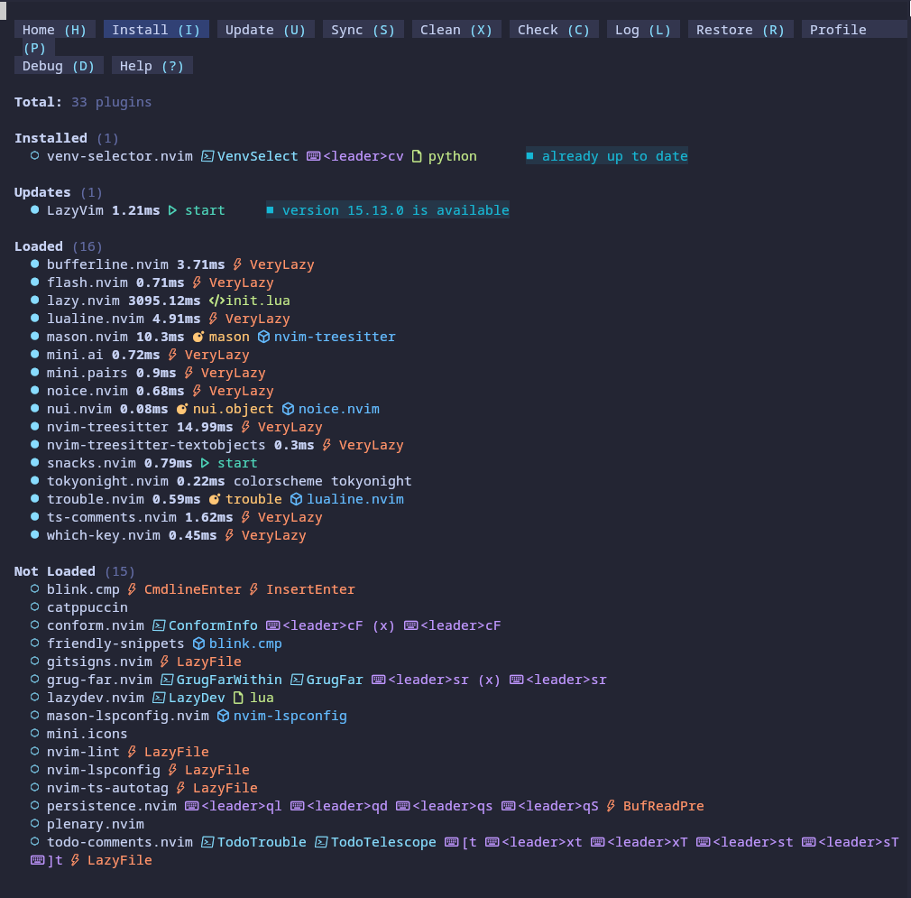

I’ve lived in `vi/vim` for 20+ years. It’s everywhere, it boots fast, it never asks for much. But I kept side‑eyeing Neovim because of all the modern niceties - LSP, treesitter, async plugins - and never wanted to spend whole day wiring it all up.

I finally switched. This is how I turned Neovim (via LazyVim) into a comfortable Python IDE on Arch. Think LSP, linting, formatting, and debugging - without yak‑shaving a monster config.

## Specification

item | spec
-- | --
os | Arch Linux with Hyprland  
kernel | 6.18+  
hardware | ASUS ROG Zephyrus G14

## Steps

#### Install `neovim` and `lazyvim`

```sh
git clone https://github.com/LazyVim/starter ~/.config/nvim
```

#### Launch `nvim` with `lazyvim` started

```sh
nvim
```

You'll see the following. Toggle the plugins you want.




#### Enable Python IDE basics

LazyVim ships with a Python extras pack. The quickest way is to add it to your config:

```sh
echo 'return { import = "lazyvim.plugins.extras.lang.python" }' \
  > ~/.config/nvim/lua/plugins/python.lua
```

Reload Neovim and run `:Lazy sync`. That pulls in:

- `pyright` for LSP and type checking
- `ruff` for linting + quick fixes
- `black` (or `ruff format`) for formatting
- `debugpy` for debugging via `nvim-dap`

#### Install the tooling on Arch

```sh
sudo pacman -S neovim python python-pip
pip install --user pyright ruff black debugpy
```

If you prefer `pipx`, swap the last line for:

```sh
pipx install pyright ruff black debugpy
```

#### Use it day-to-day

- Open a project: `nvim .`
- LSP actions: `gd` (definition), `gr` (references), `<leader>ca` (code action)
- Formatting: `<leader>cf` (or enable format on save in LazyVim settings)
- Lint fixes: `:RuffFixAll` or just run `<leader>cf` when Ruff is the configured formatter
- Debug: `:DapContinue` to start/attach, `<leader>db` to toggle breakpoints

#### Optional tweaks

- Virtualenv awareness: activate your venv (`python -m venv .venv && source .venv/bin/activate`) so Pyright and tools pick it up.
- Type checking level: add `pyrightconfig.json` with `"typeCheckingMode": "strict"` if you like extra noise.
- Import sorting: keep using Ruff; set it as the formatter to get `ruff format` + `ruff check --fix`.

#### Why LazyVim?

- Sensible defaults without a giant dotfiles repo.
- Treesitter, telescope, statusline, bufferline—already wired.
- Extras packs let you opt into language support instead of building it from scratch.

That’s the whole move: clone LazyVim, drop in the Python extras, install the Python tools, and you’re in a modern Neovim IDE without losing the modal muscle memory.