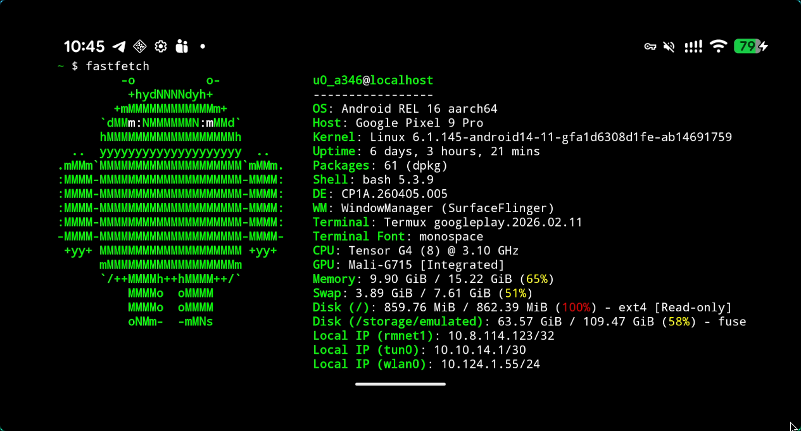

# How to Manage Your Android Device from Hyprland (The Arch Linux Way)


<p align="center">The above screen is captured from ArchLinux Desktop</p>


Managing an Android device doesn't have to mean clunky VNC setups or bloated third-party software. For Arch Linux users on Hyprland, the most efficient "Unix-way" to handle mobile management is through lightweight, high-performance tools that integrate directly with your terminal and compositor. This guide covers how to use **scrcpy** for screen mirroring, ADB for command-line control, and Waydroid for native app execution.

## The Unix Philosophy: scrcpy
While VNC is a generic protocol, **scrcpy** is a specialized tool that uses the Android Debug Bridge (ADB) to mirror your screen with near-zero latency. It requires no app installation on the phone and handles Wayland input perfectly.
## Installation and Setup
First, install the necessary tools from the Arch repositories:

```sh
sudo pacman -S scrcpy android-tools
```

Prepare your Android device:

   1. Enable Developer Options by tapping "Build Number" 7 times.
   2. Toggle on USB Debugging.
   3. Plug the device in and authorize the connection.

## Launching the Mirror
Run the following in your terminal to start the session:

```sh
scrcpy
```

For a wireless connection, initialize TCP mode while plugged in, then connect over your local network:

```sh
adb tcpip 5555
adb connect <phone_ip>:5555
scrcpy
```

From command line:

```sh
[jeff@rog ~]$ scrcpy 
scrcpy 3.3.4 <https://github.com/Genymobile/scrcpy>
INFO: ADB device found:
INFO:     -->   (usb)  4B231FDAP001SN                  device  Pixel_9_Pro
/usr/share/scrcpy/scrcpy-server: 1 file pushed, 0 skipped. 130.8 MB/s (90980 bytes in 0.001s)
[server] INFO: Device: [Google] google Pixel 9 Pro (Android 16)
INFO: Renderer: opengl
INFO: OpenGL version: 4.6 (Compatibility Profile) Mesa 26.0.6-arch1.1
INFO: Trilinear filtering enabled
INFO: Texture: 960x2136
```


## Direct Management via ADB
If you prefer the command line over a GUI, ADB (Android Debug Bridge) allows you to treat your phone like a remote server. This is the ultimate "Unix-way" to manage files and system settings.

## Common Commands

* Access the phone shell: `adb shell`
* Send files: `adb push <local_path> <remote_path>`
* Get files: `adb pull <remote_path> <local_path>`
* Install packages: `adb install <app_name.apk>`


## Native Integration: Waydroid
For those who want Android apps to live directly inside their Hyprland workspace as native windows, Waydroid is the premier solution. It runs a full Android system in a container (LXC) for maximum performance.

#### Available via the AUR

```sh
yay -S waydroid
```

## Storage and Files
To make your phone appear as a standard drive in your file manager (like Thunar or Dolphin) under Hyprland, use udiskie to handle automounting.

#### Add this to your hyprland.conf
```sh
exec-once = udiskie &
```

## References

* Arch Wiki: Android Debug Bridge
* Scrcpy GitHub Repository
* Waydroid Project Documentation
* Arch Wiki: Hyprland