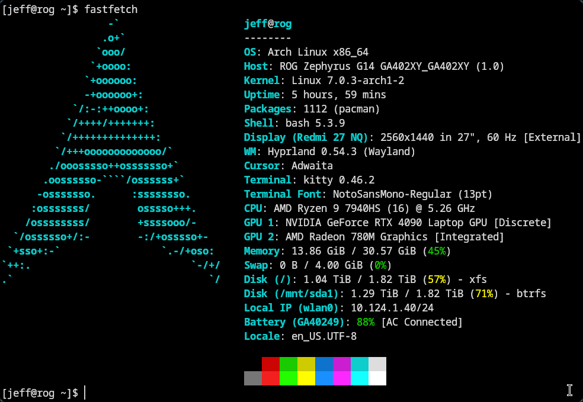

# Optimizing Arch Linux for a Closed-Lid Dual Monitor Setup - Solving USB-C Wake Issues

This is a complete, technical guide structured as a markdown blog post. It documents the journey from a flickering USB-C dock to a rock-solid Arch Linux workstation setup.

Using a laptop like the Dell XPS 13 as a docked workstation on Linux often presents two major headaches: aggressive **power management killing USB peripherals** and the system **failing to wake from sleep while the lid is closed**.

This guide outlines a proven configuration to ensure your external monitor, keyboard, and mouse remain responsive, even during long idle periods.



<p align="center">The external display is connected using an HDMI cable through a USB-C hub</p>

## The Problem

When using a USB-C/HDMI hub with the laptop lid closed:

   1. USB Autosuspend: The kernel cuts power to the hub after 2 seconds of inactivity.
   2. Lid Logic: The system suspends by default when the lid is closed, even if an external monitor is active.
   3. Handshake Failure: Many USB-C docks fail to re-initialize video/data streams after a deep system suspend (S3 or Modern Standby).

## Step 1: Prevent USB Hub "Death" (Udev Rule)

We must stop the kernel from automatically suspending USB devices. While global settings exist, a Udev rule is the most reliable way to force USB controllers to stay "on."

Create the rule file:

```bash
sudo nano /etc/udev/rules.d/00-disable-usb-autosusp.rules
```

Add the following content:

```
ACTION=="add|change", SUBSYSTEM=="usb", ATTR{power/control}="on"
ACTION=="add|change", SUBSYSTEM=="pci", ATTR{power/control}="on"
```

Apply the rule immediately:

```bash
sudo udevadm control --reload-rules && sudo udevadm trigger
```

## Step 2: Configure Systemd Lid Logic

To use the laptop as a desktop, we need to prevent systemd-logind from suspending the machine when the lid is shut.

Edit the login manager configuration:

```bash
sudo nano /etc/systemd/logind.conf
```

Uncomment and set these specific lines:

```
HandleLidSwitch=ignore
HandleLidSwitchExternalPower=ignore
HandleLidSwitchDocked=ignore
```

Restart the service to apply:

```bash
sudo systemctl restart systemd-logind
```

## Step 3: Refine Hypridle for "Safe" Power Saving

Instead of allowing the laptop to enter a deep sleep (suspend), we will configure hypridle to only turn off the monitor. This saves power and prevents screen burn-in without breaking the USB handshake.

Edit `~/.config/hypr/hypridle.conf`:

```ini
general {
    lock_cmd = pidof hyprlock || hyprlock
    before_sleep_cmd = loginctl lock-session
    after_sleep_cmd = hyprctl dispatch dpms on
    # Critical: allows Waybar to inhibit idle
    ignore_dbus_inhibit = false             
}

# Lock the session first
listener {
    timeout = 300
    on-timeout = loginctl lock-session
}

# Turn off the monitor (DPMS) but keep the system awake
listener {
    timeout = 330
    on-timeout = hyprctl dispatch dpms off
    on-resume = hyprctl dispatch dpms on
}

# Note: systemctl suspend has been removed to prevent dock disconnects
```

## Step 4: Add a Manual "Coffee Break" Toggle (Waybar)

Sometimes you need the screen to stay on (e.g., during long downloads). We use the Waybar idle_inhibitor module for a visual toggle.

### Waybar Config

Add the module to your `~/.config/waybar/config`:

```json
"modules-right": ["idle_inhibitor", "clock"],
"idle_inhibitor": {
    "format": "{icon}",
    "format-icons": {
        "activated": "☕",
        "deactivated": "󰾪"
    },
    "tooltip": true,
    "tooltip-format-activated": "Idle Inhibited",
    "tooltip-format-deactivated": "Idle Enabled"
}
```

### Waybar Styling

Add a muted dark-mode aesthetic to `~/.config/waybar/style.css`:

```css
#idle_inhibitor {
    margin-left: 5px;
    padding-right: 15px;
    background: #282a36; 
    color: #6272a4;      
    border-top-left-radius: 10px;
    border-bottom-left-radius: 10px;
}

#idle_inhibitor.activated {
    background: #44475a; 
    color: #8be9fd;      
    border-bottom: 2px solid #8be9fd;
}
```

## Verification

To ensure your USB devices are no longer permitted to sleep, run this command:

```bash
ls /sys/bus/usb/devices/*/power/control | xargs -I {} sh -c 'echo -n "{}: "; cat {}'
```

Every entry should now return on.

## Conclusion

By shifting the power management strategy from "System Suspend" to "Monitor Standby" and hardening the USB power rules, the Arch/Hyprland experience on a docked Dell XPS becomes seamless. You can now walk away from your desk and return to a working session every time.
