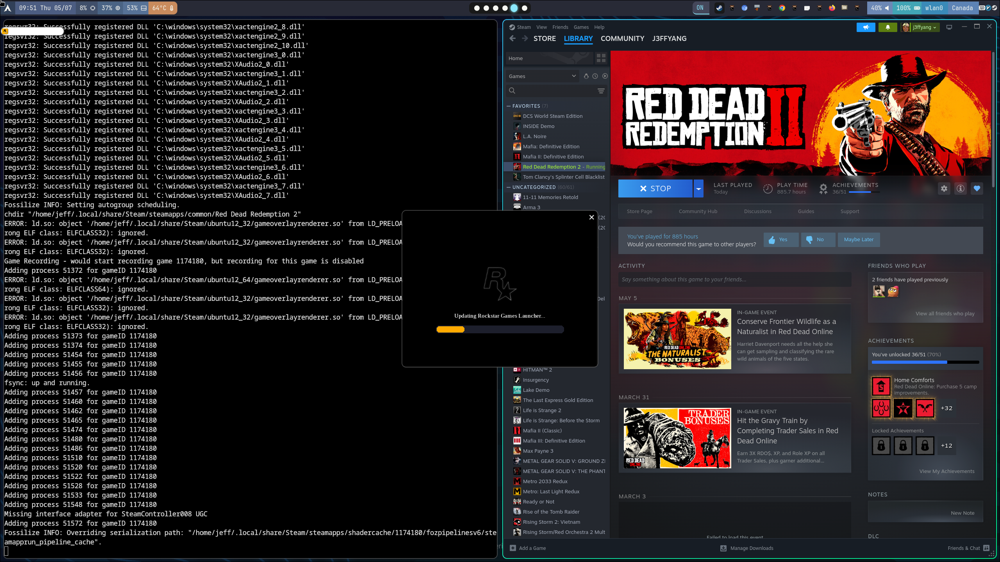

# Optimizing your ROG Zephyrus G14 on Arch Linux with Hyprland 

Optimizing your ROG Zephyrus G14 on **Arch Linux** with Hyprland is a game-changer for both **performance** and **battery** life. Since you are using the **g14** repository maintained by the ASUS Linux community, you get access to custom kernels and tools specifically tuned for your hardware.


<p align="center">Steam on ArchLinux with Nvidia GPU</p>

Here is a quick guide to getting your system dialed in.

## Hardware Spec

```sh
sudo dmidecode | grep -A 9 "System Information"
System Information
	Manufacturer: ASUSTeK COMPUTER INC.
	Product Name: ROG Zephyrus G14 GA402XY_GA402XY
	Version: 1.0
	Serial Number: RxxxxxxxxxxxxA
	UUID: 12345678-1234-1234-1234-1234567890
	Wake-up Type: Power Switch
	SKU Number:  
	Family: ROG Zephyrus G14
```

## Step 1: Set up the g14 Repository

To get the best out of your hardware, you need the specialized repository for ASUS ROG laptops.

Edit your pacman configuration: 

```sh
sudo vim /etc/pacman.conf
```

Add the following lines to the end of the file:

```conf
[g14]
SigLevel = DatabaseNever Optional TrustAll 
Server = https://arch.asus-linux.org
```

Update your system: 

```sh
sudo pacman -Syu
```

## Step 2: Install Required Packages

With the repo active, install the core tools needed to manage your laptop’s power and features.

Install the ASUS daemon and control tools:

```sh
sudo pacman -S asusctl rog-control-center
```

(Optional) If you want the optimized kernel: (I didn't do this. Just use standard kernel instead)

```sh
sudo pacman -S linux-g14 linux-g14-headers
```

Enable and start the daemon:

```sh
sudo systemctl enable --now asusd
```

## Step 3: Set Power Profiles and Battery Limits

Under Hyprland, you likely want to manage your hardware via the terminal or keybinds. Use asusctl to find the sweet spot between thermals and longevity.

#### Set Performance to Balanced

To balance fan noise and power, switch to the "Balanced" profile:

```sh
# view the profile
asusctl profile get

# set the profile
asusctl profile set Balanced
```

#### Set Battery Charge Limit

To extend the lifespan of your battery - especially if you stay plugged into a desk - limit the max charge to 60%:

```sh
asusctl battery limit 60
```

## Pro Tip for Hyprland Users

Add these to your `./conf/hypr/hyprland.conf` to cycle profiles with your keyboard:

```conf
bind = , XF86Launch4, exec, asusctl profile -n
```

This allows you to toggle between Quiet, Balanced, and Performance modes on the fly without leaving your workspace.