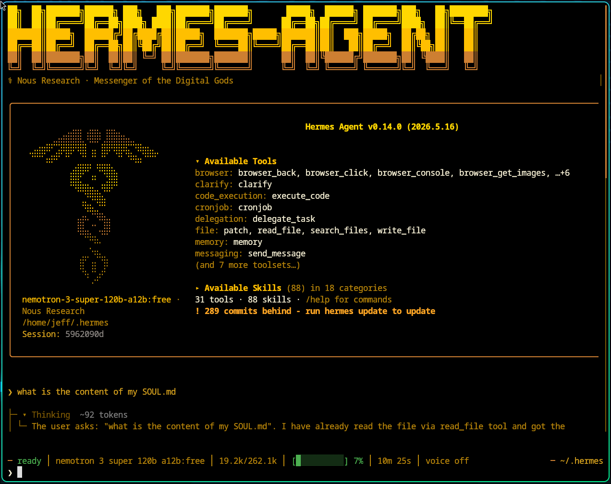

# How to Play with SOUL.md in Hermes Agent

## At a glance

- **File:** `~/.hermes/SOUL.md` (or `$HERMES_HOME/SOUL.md`) — instance-wide persona, not per-repo.
- **Role:** Agent identity (voice, tone, boundaries). Facts and project rules belong in `MEMORY.md` / project context files.
- **Reload:** Edits apply when a **new session** starts (cached system prompt is built at session start).
- **Verify:** `cat ~/.hermes/SOUL.md`; start a fresh session; use `hermes dump` or `hermes doctor` if behavior still looks wrong.

Practically using SOUL.md in the Hermes Agent (v0.13+, as of May 2026) means defining the agent's core identity, tone, and boundaries. That content becomes the **agent identity block**—the **first section of the cached system prompt**, before tool guidance, memory snapshots, skills, and project context—so it anchors behavior across sessions. Edit the file at `~/.hermes/SOUL.md` (or `$HERMES_HOME/SOUL.md`) directly. Unlike MEMORY.md, which is episodic, SOUL.md is persistent "personality as infrastructure" that survives across sessions and dictates who the agent is.

> **Note:** `SOUL.md` is for persona and enduring values; use `AGENTS.md` in your repo for daily operational rules. CLI flags, plugin names, and commands can change by release—confirm with `hermes help` and your version's release notes.

## File structure & hierarchy

| Feature | Location | Scope | Notes |
| --- | --- | --- | --- |
| `SOUL.md` | `~/.hermes/` | Instance-wide persistent identity | **Auto-seeded** on first run if missing |
| `AGENTS.md` | Project (CWD at startup) | Project rules, conventions, architecture | **You create this**; most common project context file |
| `/personality` | Chat session | Temporary mode switch | Does not change `SOUL.md` |
| `USER.md` | `~/.hermes/memories/` | Who you are (not the agent) | Injected context snapshot |

**Optional project files (not created by default):** Hermes can also load `.hermes.md` or `HERMES.md` if you add one in a repo (walks up to git root; **highest priority** among project-context types, ahead of `AGENTS.md`). A standard install does not place these files anywhere—you will not see them unless you create them. On a typical machine you only have `~/.hermes/SOUL.md` plus `AGENTS.md` in projects where you added it.

**Project-context priority** (first match wins; only one type per session): `.hermes.md` / `HERMES.md` → `AGENTS.md` → `CLAUDE.md` → `.cursorrules` / `.cursor/rules/*.mdc`. See [Context Files](https://hermes-agent.nousresearch.com/docs/user-guide/features/context-files).

**SOUL vs overlays:** `SOUL.md` is your durable default everywhere. `/personality` only adjusts the current session's system prompt and does not rewrite `SOUL.md`.

## 1. Initial setup: create your SOUL

Hermes seeds a default `SOUL.md` at `~/.hermes/SOUL.md` if none exists (existing files are never overwritten).

Open it and write plain Markdown—roughly 3–5 sentences covering:

- **Role** (e.g., "You are an aggressive Python optimization bot")
- **Tone** (e.g., "Be concise, use technical jargon; push back bluntly on vague asks")
- **Boundaries** (e.g., "Never suggest ChatGPT; prefer local models")

Minimal starter: *You are [role]. Communicate [tone]. Never [hard boundary]. When uncertain, [default behavior].*

**After editing:** exit and start a **new Hermes session** (or restart the CLI/gateway). SOUL is read when the cached system prompt is assembled at session start—not on every message mid-session.

Very large SOUL files may be truncated after security scanning (Hermes caps injected context size).

## 2. Core practical workflows

- **Manual persona customization:** Hand-edit with any Markdown editor. Aim for stable voice guidance, not project facts.
- **Automated generation:** If the Soul Forge plugin is installed, generate a `SOUL.md` from templates ("Code Architect," "Patient Tutor") or from a plain-English description.
- **Active feedback loop:** Hermes can update its own `SOUL.md` (e.g., "You're too formal—adjust your soul to be more casual"). Review diffs and keep a backup copy before relying on self-edits.
- **Session overlays:** `/personality` applies temporary system-prompt presets without changing your global soul.
- **Instance profiles:** `hermes profile create` (optionally `--clone`) gives separate `HERMES_HOME` directories, each with its own `SOUL.md`.

## 3. Practical "play" scenarios

- **Persona switch:** A "Critical Code Reviewer" profile and a "Creative Writer" profile—each with its own `SOUL.md` under its profile home—via `hermes profile create --clone`.
- **Memory habit (not content in SOUL):** Prefer storing project status in `MEMORY.md`. In SOUL, describe *how* to use memory (e.g., "Before guessing project state, check memory tools or `MEMORY.md`") rather than pasting file paths as facts.
- **Refusal training:** In SOUL.md: "If I ask you to write JavaScript, refuse and remind me we are a Python-only team."
- **Tone generator:** In SOUL.md: "Always start with a 5-word summary, then bullet points, and do not use emojis."

## 4. Iterative evolution (self-improving loop)

- **Correction:** After a bad response: "That was too verbose. Update your SOUL.md to be more concise in the future."
- **Skill integration:** Paste durable voice/decision-style guidance from a skill (e.g., Cursor `SKILL.md`) into `SOUL.md`, or install equivalent Hermes skills—keep SOUL for identity, skills for repeatable workflows.

## 5. Debugging & testing

- **Check the file:** `cat ~/.hermes/SOUL.md` — confirm you edited the instance home, not a repo-local copy (Hermes does not load `SOUL.md` from the working directory).
- **Confirm instance:** `hermes dump` — shows `hermes_home`, profile, and config summary ([CLI reference](https://hermes-agent.nousresearch.com/docs/reference/cli-commands/)). There is no `hermes agent` subcommand.
- **Config health:** `hermes doctor` — surfaces missing config, path, or dependency issues.
- **Behavior check:** Start a **new session**, then chat; if voice is still wrong, check whether a `/personality` overlay is active or the file is empty/truncated/scanned.

Official troubleshooting: [Use SOUL.md with Hermes](https://hermes-agent.nousresearch.com/docs/guides/use-soul-with-hermes) · [Personality & SOUL.md](https://hermes-agent.nousresearch.com/docs/user-guide/features/personality) · [Prompt assembly](https://hermes-agent.nousresearch.com/docs/developer-guide/prompt-assembly)

## Practical refinement tips

- **Avoid overlap:** Keep factual knowledge and project details in `MEMORY.md` or `AGENTS.md`. The soul is for how the agent thinks and speaks, not what it knows.
- **Set hard boundaries:** Use the soul for what the agent will never do (e.g., "Never use emojis," "Never suggest cloud-based solutions").
- **Instance profiles:** For entirely different agents (e.g., "Researcher" vs. "Developer"), use `hermes profile create`. Each profile keeps its own `SOUL.md` in its respective home directory.